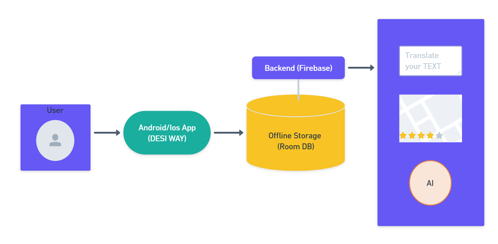
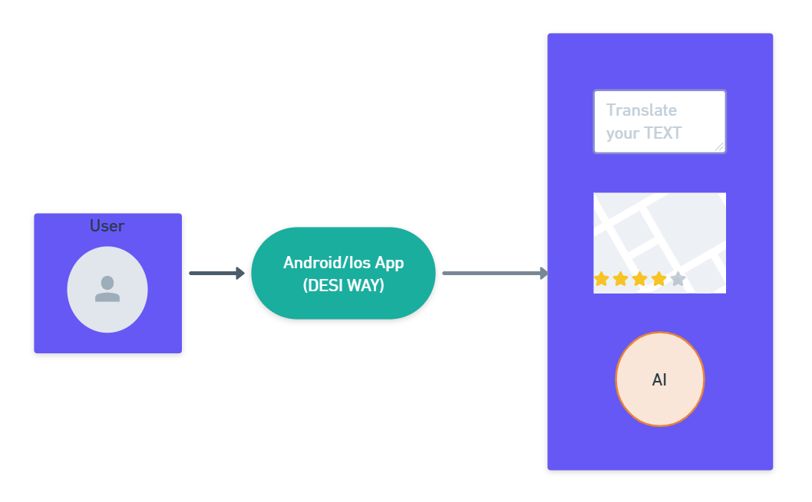
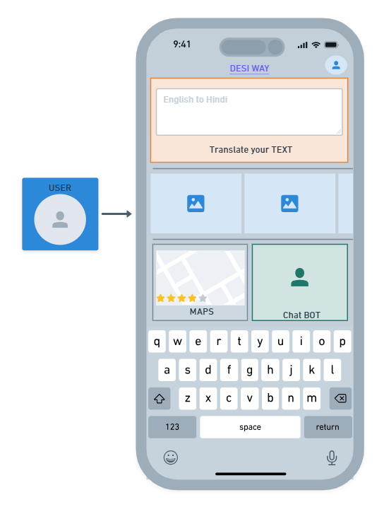
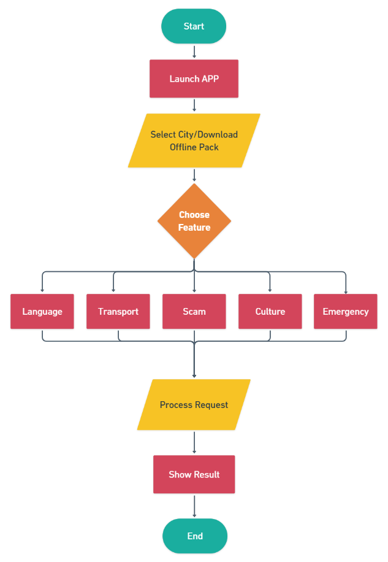
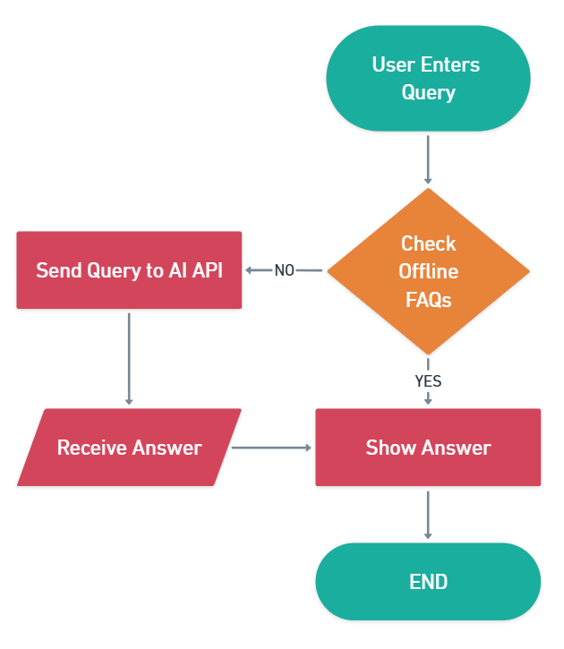
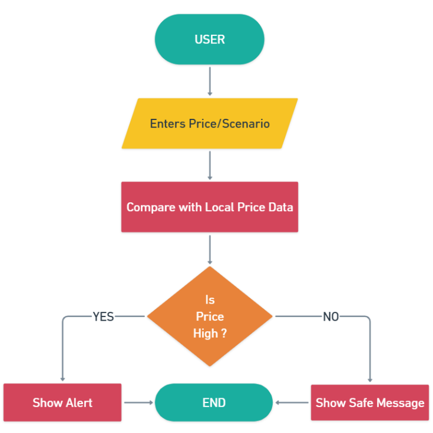

> **A smart, offline-fast travel assistant app for foreign tourists
> visiting India**

# Problem Statement 

India attracts millions of foreign tourists every year, but visitors
often face challenges such as language barriers, transport confusion,
cultural misunderstandings, safety concerns, scams, and lack of
emergency guidance. Unlike countries such as Japan, India doesn't have a
unified, tourist-centric mobile application that provides all essential
assistance in one place.

# Solution Overview

Desi Way (India Visitor Companion) is an Android/Ios application
designed to act as a single digital guide for foreign travels in India.

The app focuses on **offline usability, safety, cultural guidance,** and
**real-time assistance,** making travel in India easier, safer, and more
enjoyable.

# Key Objectives

- Help foreign tourists overcome **language barriers.**

- Protect visitors from **scams** and **overcharging.**

- Simplify **local transport navigation.**

- Provides **cultural etiquette guidance.**

- Enable **quick emergency assistance.**

- Work reliably in **low** or **no internet conditions.**

# Features

## Core Features (MVP)

### Language Bridge

- Offline phrasebook (English -\> Hindi & regional languages)

- Camera-based text translation (menus, signboards)

- "Show-to-Local" phrase display

- Text-to-speech for pronunciation

### Scam & Overcharge Protection

- Common tourist scam alerts

- Expected price ranges for autos, taxis, food

- Quick "Am I Overcharged?" checker

### Transport Assistant

- Metro, bus & auto guidance (city-wise)

- Step-by-step "How to travel" instructions

- Offline maps and route explanations

### Cultural & Etiquette Guide

- Do's & Don'ts by region

- Temple/mosque etiquette

- Tipping and dress guidance

### Emergency & Safety Mode

- SOS with live location

- Local emergency numbers

- Embassy contact storage

- Medical & police phrase cards

## Advanced Features (Future Scope)

1.  AI-based travel assistant chatbot

2.  Offline city packs

3.  Itinerary planner

4.  Trusted local volunteer help

5.  Festival & weather alerts

# Tech Stack

  -----------------------------------------------------------------------
            Layer                             Technology
  -------------------------- --------------------------------------------
           Frontend                 Kotlin+Flutter+Jetpack Compose

           Backend                        Firebase/Supabase

           Database                     Room (Offline Storage)

             Maps                         Google Maps/Mapbox

      ORC & Translation                     Google ML Kit

         AI Assistant                   LLM API (cached FAQs)
  -----------------------------------------------------------------------

#  System Architecture (High-Level)

# Data Flow Diagram

## DFD Level 0 (Context Diagram)

## DFD Level 1

# Flowcharts

## Overall User Flow

## AI Assistant Flowchart

## Scam Detection Flow

# Privacy & Security

- No unnecessary personal data stored

- Location access only during emergency

- Encrypted local storage

- GDPR-Friendly data handling

# Future Enhancements

- Voice-based assistant

- Wearable integration

- Tourist police dashboard

- Offline AI models

# Conclusion

Desi Way (India Visitor Companion) aims to become the **official digital
travel partner** for foreign tourists in India by providing safety,
clarity, and confidence---similar to visitor apps used in **Japan.**

For the app details see README02.md
